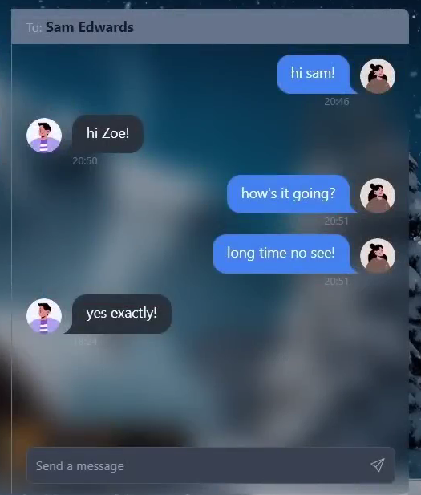

# Portfolio Website

Welcome to my portfolio website! This repository contains the source code and assets for my personal portfolio website, where I showcase my skills, experience, and projects as a Full-Stack Developer.

## Table of Contents

- [About](#about)
- [Experience](#experience)
- [Projects](#projects)
- [Contact](#contact)
- [Usage](#usage)
- [Development](#development)

## About


I'm **Chathura Abeygunawardhana**, a passionate Full-Stack Developer with a mission to turn digital dreams into stunning realities. With a keyboard as my paintbrush and code as my canvas, I craft immersive online experiences that captivate and inspire. From sleek, responsive designs to seamless user interactions, I thrive on the ever-evolving challenges of the web development world.

### Experience

- **Full-Stack Development:** 1 year of experience
  - React JS: Intermediate
  - HTML: Experienced
  - CSS: Intermediate
  - JavaScript: Experienced
  - Bootstrap: Intermediate
  - Angular JS: Basic

### Education

- **B.Sc. Honours in Information Technology**
  - University of Moratuwa

Join me on this exhilarating journey as we shape the future of the internet, one line of code at a time.

## Experience

Explore my experience as a Full-Stack Developer:

- **Full-Stack Development**

  - React JS: Intermediate
  - HTML: Experienced
  - CSS: Intermediate
  - JavaScript: Experienced
  - Bootstrap: Intermediate
  - Angular JS: Basic

- **Backend Development**
  - MYSQL: Experienced
  - Node JS: Intermediate
  - Express JS: Intermediate
  - Mongo DB: Intermediate

## Projects

Browse my recent projects:

### Car Repair Service


- [GitHub Repository](https://github.com/ChathuraAbeygunawardhana/landing-page)
- Live Demo: Coming Soon

### Hotel Website


- [GitHub Repository](https://github.com/)
- Live Demo: Coming Soon

### Python Calculator



- [GitHub Repository](https://github.com/ChathuraAbeygunawardhana/Python-Calculator)
- Live Demo: Coming Soon

## Contact

Feel free to get in touch:

- Email: [chathuraabeygunawardhana@gmail.com](mailto:chathuraabeygunawardhana@gmail.com)
- LinkedIn: [LinkedIn Profile](https://www.linkedin.com/in/chathura-abeygunawardhana)

## Usage

To view my portfolio website, simply open [the live website link](https://your-website-link.com/) in your web browser.

## Development

If you want to run this website locally or contribute to it, follow these steps:

1. Clone the repository:
   ```bash
   git clone https://github.com/YourUsername/YourPortfolioWebsite.git
   ```
